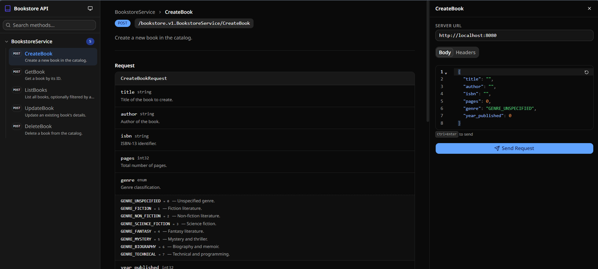

# ConnectRPC Docs

Interactive API documentation for [ConnectRPC](https://connectrpc.com/) services. Parses `.proto` files at runtime — no code generation required.



## Usage

Load the single-file IIFE via jsDelivr and pass your proto file contents:

```html
<!DOCTYPE html>
<html lang="en">
<head>
  <meta charset="UTF-8" />
  <meta name="viewport" content="width=device-width, initial-scale=1.0" />
  <title>API Docs</title>
  <style>html, body, #root { margin: 0; height: 100%; }</style>
</head>
<body>
  <div id="root"></div>
  <script src="https://cdn.jsdelivr.net/gh/priyanshu-shubham/connectrpc-docs@main/dist/api-explorer.iife.js"></script>
  <script>
    ApiExplorer.render({
      target: document.getElementById("root"),
      protoFiles: {
        "myservice/v1/service.proto": "syntax = \"proto3\";\n...",
      },
      title: "My API",
      baseUrl: "http://localhost:8080",
    });
  </script>
</body>
</html>
```

`protoFiles` is a `Record<string, string>` — keys are file paths, values are the raw `.proto` file contents. Your server reads the proto files and injects them as JSON into the HTML template.

## Configuration

| Property     | Type                           | Default                  | Description                        |
| ------------ | ------------------------------ | ------------------------ | ---------------------------------- |
| `target`     | `HTMLElement`                  | **(required)**           | DOM element to render into         |
| `protoFiles` | `Record<string, string>`       | **(required)**           | Proto file contents keyed by path  |
| `title`      | `string`                       | `"API Explorer"`         | Sidebar header title               |
| `iconUrl`    | `string`                       | Built-in icon            | URL to a custom icon image         |
| `theme`      | `"light" \| "dark" \| "system"` | `"system"`               | Initial color theme                |
| `baseUrl`    | `string`                       | `window.location.origin` | Server URL for ConnectRPC requests |

Returns `{ unmount(): void }` to clean up.

## Try it locally

The `example/` directory has a mock BookstoreService you can test with:

```bash
npm install && npm run build:lib
python example/server.py
# Open http://localhost:8080
```

## Development

```bash
npm install
npm run dev          # dev server with hot reload
npm run build:lib    # build dist/api-explorer.iife.js
```
